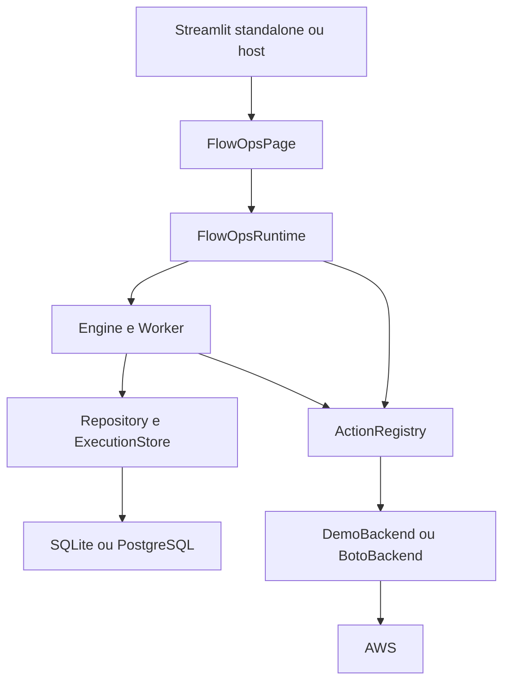

# Arquitetura

## Visão geral

AWS FlowOps Studio separa apresentação, aplicação, domínio, persistência e providers para que
o Streamlit não seja a fonte de verdade do produto.

## Camadas

### Domain

`flowops/domain` contém modelos Pydantic e erros. Runbook, Node, Edge, Parameter, Identity,
AWSContext e Execution não dependem do Streamlit ou boto3.

### Core

`flowops/core` contém validação de DAG, resolução segura de expressões, políticas, registro de
ações, engine, worker, serialização e sanitização. O engine recebe interfaces concretas por
composição e é utilizável por UI, testes e futuros hosts CLI/API.

### Persistence

`Repository` e `ExecutionStore` armazenam drafts, versões publicadas, snapshots, checkpoints,
aprovações, locks e auditoria. SQLite é o backend local; PostgreSQL é o backend de produção.
Migrations numeradas são compartilhadas pelos dois.

### Providers

O provider AWS usa modelos botocore para schemas e validação de operações. O catálogo curado
atribui risco, leitura/mutação, idempotência e permissões IAM. Operações fora do catálogo só
podem ser registradas por allowlist explícita e são classificadas conservadoramente.

`DemoBackend` oferece o mesmo contrato para desenvolvimento/testes e mantém simulação isolada
por execução.

### Presentation

`FlowOpsPage` é a fronteira de embedding. `FlowOpsUI` implementa o workspace e o canvas, mas
não executa operações duráveis em rerun implícito: persistência e execução dependem de ações
explícitas do usuário.

## Runbook e versionamento

Um draft possui revisão mutável com compare-and-swap. A publicação cria uma linha imutável em
`runbook_versions` com digest SHA-256 da definição. Uma execução sempre carrega um snapshot da
versão publicada e valida seu digest antes de continuar.

YAML/JSON de exportação é determinístico e pode ser usado em GitOps. Importação cria novo draft
por padrão e rejeita estruturas que aparentem conter segredos.

## DAG e expressões

O validador exige um único Start, término alcançável, aciclicidade, edges/branches válidos e
referências apenas a parâmetros/contexto/nós ancestrais. A DSL de expressões resolve caminhos
e templates controlados; não usa `eval` ou execução arbitrária de Python.

## Execução

1. `Engine.submit` valida versão publicada, parâmetros, ambiente e policy e persiste a
   solicitação de forma idempotente pelo token.
2. `LocalWorker` executa assíncronamente e o `ExecutionStore.claim` faz CAS de `PENDING` para
   `RUNNING`.
3. Execuções não simuladas adquirem lock por `mode:account:region`; leituras dentro do DAG podem
   paralelizar, enquanto mutações são serializadas pelo engine.
4. Cada nó persiste checkpoint. Em retomada, resultados concluídos são reconstruídos do banco.
5. Aprovações colocam a execução em `WAITING_APPROVAL`, persistem preview e liberam o lock
   grosseiro enquanto aguardam decisão humana.
6. Conclusão/cancelamento libera locks e registra auditoria.
7. O worker chama o hook de cleanup do provider em `finally`, liberando sessões/clientes por
   execução.

## Aprovações

O digest da aprovação inclui snapshot/contexto/input resolvido. Isso impede que uma decisão
seja reutilizada depois de mudança material. Por padrão, ambientes sensíveis respeitam
separação entre solicitante e aprovador quando two-person rule está habilitada.

## Simulação

`dry_run=True` significa simulação FlowOps. A engine chama `preview()` para ações mutáveis em
vez de `execute()`. No backend demo, uma cópia isolada do estado permite que passos posteriores
observem efeitos simulados sem alterar a fixture persistente. Isso é independente de qualquer
`DryRun` nativo do SDK AWS.

## Concorrência e consistência

- drafts: revisão otimista;
- submissão: token + digest;
- claim: compare-and-swap de status;
- locks: `INSERT ... ON CONFLICT DO NOTHING`, compatível com SQLite/PostgreSQL;
- checkpoints: upsert por execução/nó;
- versões: insert-only + digest;
- workers: estado autoritativo no banco, nunca em `st.session_state`.

## Extensão

Novas ações implementam o contrato do `ActionRegistry`. Para AWS, prefira catálogo curado. O
caminho genérico deve continuar opt-in no host para evitar transformar o produto em um console
AWS irrestrito.
